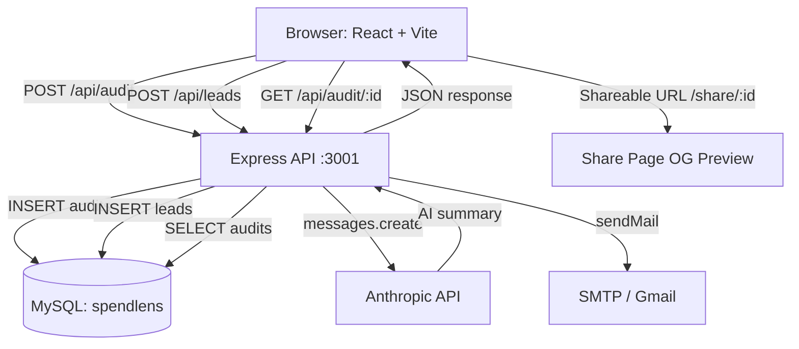

# Architecture — SpendLens

## System Diagram

## Data Flow — User Input to Audit Result

1. **Form input persisted to localStorage** via `useAuditStore` hook (zustand-style). Survives page reloads.
2. User submits → `POST /api/audit` with `{ tools: [...], teamSize, useCase }`.
3. `runAuditEngine()` evaluates each tool: plan-fit check, seat count, use case alignment, overlap detection. Pure function — no I/O, fully testable.
4. `generateAISummary()` calls Anthropic claude-sonnet-4-20250514 with a CFO-framed prompt. Falls back to a templated summary if API is unavailable or key is missing.
5. Result is assigned a UUID, stored in MySQL `audits` table with `tools_input`, `findings` (JSON), savings figures, and summary.
6. Frontend receives `{ auditId, findings, totalMonthlySavings, ... }` and navigates to `/results/:auditId`.
7. Share URL `/share/:auditId` fetches from `GET /api/audit/:id` — identifying fields (email, company) are never stored on the audit row, only on the leads row.

## Stack Choices

| Layer | Choice | Reason |
|-------|--------|--------|
| Frontend | React 18 + Vite | Fast HMR, simple SPA — no SSR needed |
| Styling | Tailwind CSS | Utility-first, consistent design tokens |
| Animation | Framer Motion | Declarative, production-grade transitions |
| Routing | React Router v6 | Industry standard, nested route support |
| Backend | Node.js + Express | Minimal overhead, ES modules, fast iteration |
| Database | MySQL 8 | Relational, widely hosted, JSON column support |
| ORM | mysql2/promise | Lightweight, prepared statements prevent SQL injection |
| AI | Anthropic SDK | claude-sonnet-4-20250514 for summary generation |
| Email | Nodemailer | SMTP-agnostic — works with Gmail, Sendgrid, SES |
| Language | JavaScript (ES modules) | Speed of iteration for a 7-day build; TypeScript migration straightforward |

## Why Not TypeScript?

TypeScript adds compile step complexity without meaningful safety gains for a 7-day build where the schema is fluid. The audit engine is covered by Jest tests. TypeScript migration is a Day 1 task in Week 2.

## Scaling to 10,000 Audits/Day

Current bottlenecks and fixes:

1. **MySQL connection pool** — current `connectionLimit: 10` is fine for < 100 req/s. At 10k audits/day (~0.12 req/s avg, 10x peak = 1.2 req/s), this is more than sufficient. At 100k/day, migrate to PlanetScale or RDS with read replicas.
2. **Anthropic API latency** — AI summary adds ~1-2s per audit. At scale, move to async queue: return auditId immediately, generate summary in background, push via WebSocket or polling. Bullmq + Redis is the standard pattern.
3. **Email sending** — Nodemailer is synchronous in the lead route. Move to a job queue (Bullmq) with Resend/SES for bulk deliverability and retry logic.
4. **Static assets** — Frontend builds to static files. At 10k/day, put behind Cloudflare CDN. Zero cost, global edge.
5. **Rate limiting** — Current in-memory rate limiter resets on restart. At multi-instance scale, replace with Redis-backed rate limiting (`rate-limit-redis`).
